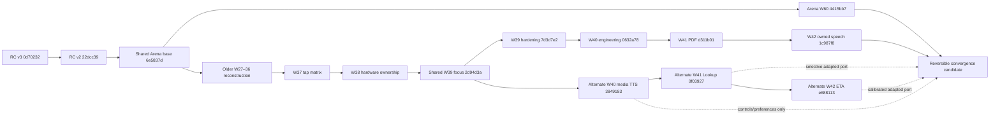

# Arena × Reader canonical convergence

This handoff supersedes the divergent development instructions. Continue development on
`integration/arena-reader-canonical-convergence-v1`. It is a reversible candidate, not a main
promotion or a release. Historical branches and PRs remain untouched.

## Repository truth

Re-fetched 2026-10-03 in Codex Cloud. All 230 remote refs (229 branch heads plus the symbolic default) and 280 PR records are inventoried in
`branches.json` and `pr-inventory.json`; 100 PRs were open at inspection. No newer remote head
than the owned W42 foundation appeared in the snapshot. Head SHAs, dates and two-sided counts
are recorded, rather than inferred from wave numbers. See `core-topology.json` for ancestry
and exact-patch equivalence counts, and the two commit ledgers for unique history.

| Source | Resolved head | Treatment |
|---|---|---|
| Arena / #349 | `4415bb723818b1b24e1ab123108122d5aca0643d` | First parent; preserve full W60 reconstruction |
| W37 / #362 | `88078a60d1b4e7c28accaf16c461f6e09ec92acb` | Contained by owned W42 |
| W38 / #363 | `2dcf3556a2177e006790811cf926741c13802d27` | Contained by owned W42 |
| W39 / #364 | `7d3d7e289e7e2dd895a8bf8772587ee78dd8ce0d` | Contained by owned W42 |
| W40 engineering / #368 | `0632a7817b954035442ca9ca7d14b57570f02087` | Contained by owned W42 |
| W41 PDF / #369 | `d311b019353fc7ad4214d931b2184f2c40e8b2c6` | Contained by owned W42 |
| W42 owned speech / #370 | `1c987f85b27be8c71892adca1966c8e1853e7ccb` | Second parent; retain reliability and tests |
| Alternate W40 / #365 | `38491836a341bfa97657f9736a6794041fa02fc8` | Audit and selective controls/preferences port |
| Alternate W41 / #366 | `0f03927ac7c774ea21bfe01591e9a07e5197ea99` | Port Process Text Lookup into atomic selection flow |
| Alternate W42 / #367 | `e688113ae73488b40caf44f1afdaf68a9fbd65a5` | Port and correct personal pace/uncertain ETA |
| Reader RC v2 / #261 | `22dcc398d6101ec0b19400dcd4e8c94e21d6c4fe` | Already ancestor of both parents |
| Reader RC v3 | `0d70232e1f36cfd99a9014d774b7ce82bc27be8d` | Ancestor of RC v2 and both parents |

Arena vs owned W42: **335 / 136** unique commits; merge base
`6e5837d04ddd5e9dd78d86556b9df50bdcf58a64`. Arena vs W39: **335 / 132**.
Owned W42 vs alternate ETA: **13 / 50**; the alternate branch lacks newer engineering fixes,
wrapper/schema assets, ownership and Focus Guide tests. It is not safe to merge wholesale.
The RC v3 name is chronologically misleading: its current head is older than RC v2 and fully
contained. Neither RC branch needs another integration merge.

## Subsystem authority and semantic resolutions

| Subsystem / conflict | Canonical result and coverage |
|---|---|
| Threshold, Book Detail, Archive, Castle, Path, Profile, gamification | Arena owns presentation, state truth and accessibility. Preserve later reconstruction rather than W27–36's older duplicate layouts. Root UI test suites remain intact. |
| Library retrieval | Arena presentation plus incoming pure title/author/series/collection/language relevance and deterministic ties; Persian normalization and relevance tests retained. |
| Reading mode / appearance | Arena's Paged/Scroll vs Paper/Slide/None separation, patina, measured-width controls, publisher capabilities and RTL remain authoritative. Older combined navigation-mode selectors are superseded. |
| Tap/keyboard/hardware | W37 matrix and W38 Activity press ownership feed Arena's semantic Paper/Slide turn methods. Preserve keyboard handling, drag reservation, preview rollback, reduced-motion snapshot avoidance and busy guards. Existing keyboard/RTL/ownership suites retained. |
| Focus Guide | Owned W39 pending-ack state, last active mode, passive Canvas and accessibility blockers; Arena appearance/layout remains intact. Settings controls live under Advanced disclosure. |
| Programmatic navigation | One gate combines Arena target identity, origin suppression, normalized links and passage visits with W41 document-page settlement. Regression tests require both matching stable target and PDF page; PDF lifecycle settlement cannot consume EPUB transactions. |
| PDF fast background / close | Link, Previous Location and Notebook PDF targets carry document-page expectations. Live reached pages flush before UI debounce. A swipe beyond the target preserves actual progress without inventing a passage visit. Dedicated convergence regression covers this. |
| PDF zoom | Preserve Arena bounded discovery, retry, adaptive layout and decoration; add lifecycle-paused zoom mirror, finite limits, centered immediate zoom and explicit tile refresh. Existing discovery and W41 zoom tests coexist. |
| Atomic selection Notes | Arena's locator-backed draft remains authoritative; no premature Highlight on Note selection. Fresh drafts lack highlight IDs, so all incoming blockers use the draft locator. Speech policy explicitly regression-tests this case. Lookup never creates an annotation. |
| Close / publication lifetime | Final session and locator durability precedes speech worker cleanup; route/publication release waits for both. Storage-before-owner-release and cancellation tests retained. |
| Page-effect buffers / resize | Arena code retains mode-owned buffers only while active, frame-safe recycling and preview rollback on handoff/viewport changes. Existing bitmap, mode, resize and motion suites retained. |
| Room / durable history | Database, DAOs, entities, migrations and schema version 3 unchanged from Arena. Authentic v1/v2/v3 schema assets are shared by both parents and remain unchanged; no migration introduced. Device migration execution remains pending. |

The conflict resolution is deliberately narrow: wholly superseded visual files retain Arena's
implementation; independent behavioral features are ported explicitly. There are no second
Reader, Settings, persistence-of-progress, page-effect or TTS controllers.

## TTS decision and selective recovery

Retain `ui/reader/tts/ReaderTtsSession` + `ReadiumTtsContent` + `AndroidReaderTtsBackend`.
Readium 3.4.0 supplies real text segments/languages/locators; Pdfium retains document ownership.
No HTML scraping, PDF text invention or dependency replacement is introduced.

Compared with alternate `ReaderTtsController` / media-TTS factory, the owned foundation has:
explicit cancellable session scope; generation/request tokens; bounded initialization/synthesis;
installed offline voice selection without network-language fallback; focus/noisy/background pause;
a retained pending content read; close/join before publication release; and injectable content/backend
interfaces with lifecycle regressions. The alternate implementation has no corresponding bounded
initialization/close join or enforced offline voice selection. Its visual-follow locator writer is
not imported. The existing source audit in `docs/handoffs/W42_TTS_FOUNDATION.md` records the
Readium media-TTS factory/collector observations; these are source findings, not device leak proof.

Recover localized Start/Pause/Resume/Stop and persisted normalized speed/pitch through this sole
session. Explicit Start uses Readium's public first-visible-element locator, with a five-second
capture deadline and owner/navigator/panel/lifecycle revalidation after suspension. Closing the
panel, stopping, backgrounding or closing Reader cancels and invalidates pending capture. Generation checks reject old completions.
Controls scroll at 200% text; English/Persian/RTL instrumentation cases compile. Slider pending
acknowledgements cannot replace newer choices. Preference changes apply at the next bounded chunk
and never auto-resume. Chunk replay on pause is truthful; exact word resume/highlighting is not claimed.

Do not port the alternate speech progress event, implicit visual following, unbounded media factory,
previous/next-sentence claims, notification or background playback. MediaSession/background
extensibility remains a future adapter over the same owner/backend contract, requiring device proof.

Lookup uses explicit Android Process Text with read-only selected text, package visibility and calm
missing-handler feedback. The existing unconditional selection-toolbar cleanup remains intact.
The selection callback revalidates Reader ownership, close state and foreground after capture.

ETA retains aggregate-only per-book DataStore statistics and uncertainty/evidence thresholds.
Calibrate active interval length against publication progression × canonical position count; viewport
pages cannot be multiplied by publication positions. Reject missing/nonfinite/backward/unchanged
progression and invalid intervals. Rebase after jumps/relayout (including duplicate locators), idle,
resume and replacement owners. Cache writes check book existence and restore generation inside the
DataStore edit; deleted/restored books cannot receive stale samples. Restore clears derived pace.
Cache I/O cannot poison durable Room progress. No new Room columns or migrations are needed.

## CI truth

`ci-diagnosis.json` records three latest W42 jobs: Android build, Room-on-Android and benchmark.
All have an empty runner name and zero steps. GitHub annotations explicitly state:

> The job was not started because recent account payments have failed or your spending limit needs
> to be increased. Please check the 'Billing & plans' section in your settings.

This is an account billing/spending-limit block, not code RED, a workflow compilation failure or
an observed test failure. No workflow disabling, lint suppression or fake success replaces it.
Direct Gradle execution in Codex Cloud supplies independent evidence.

## Test retention and cleanup

All 115 Arena Kotlin test files remain present. `test-retention.json` inventories source method
names across Arena, owned W42 and alternate ETA. Renamed/superseded cases are mapped below:

- `mirrorAndMangaChambers_areRestorableAndExclusive` → Arena's broader
  `canonicalChambers_areRestorableAndExclusive`, including both chambers and three additional ones.
- `firstSettledLocator_consumesProgrammaticTransactionOnce` → stronger
  `firstDifferentLocator_consumesProgrammaticTransactionOnce` plus origin/target/PDF regressions.
- Alternate “quick toggle … returns to focus window” → newer “restores prior active mode”; keep
  LINE resume behavior rather than restoring the stale unconditional WINDOW assertion.
- `ttsSettings_surviveSettingsStoreRecreation` is recovered into the canonical instrumentation suite.

Exact history-contained refs and refs requiring further individual audit are in
`archive-candidates.json`. After device verification and approval of this candidate, #349 and
#362–370 can be reviewed for supersession; W27–36 are older visual reference lines. RC #261's
promotion must not proceed independently of this convergence. Alternate #365–367 must not be
merged wholesale. None of these PRs were closed and no branch was deleted. Unrelated tooling,
research and feature branches with noncontained history are not certified safe to archive.

## Verification and remaining boundary

See `verification.json` and the associated evidence logs for the exact executed checks and totals.
Status categories are scoped: SOURCE-GREEN means resolved source and policy checks; BUILD-GREEN
means debug and instrumentation APKs compiled; TEST-GREEN covers executed JVM/policy/helper tests.
DEVICE-GREEN and RELEASE-GREEN are **not established**.

There is no attached device and no `/dev/kvm`. Migration/schema assets, Room atomic Notes,
PDF native links/annotation rendering, TTS backend, passive Focus Guide, 200% speech controls and
other instrumentation tests compile/package but have not run here. No release build was made.
Manual EPUB/PDF rendering, process-kill recreation, fast background/close, Paper/Slide/Paged,
TalkBack, Persian/RTL, resize/foldables, bitmap frame safety, offline voice behavior and visual
acceptance still require a stable Android device. Passing JVM tests does not substitute for this.

To undo the candidate integration while preserving Arena, revert the merge commit with parent 1
on another branch. Never reset or force-push a historical branch. Main promotion requires explicit
user approval and the remaining verification evidence.

### Collapsed ancestry graph

Edges collapse intermediate commits; the alternate line forked at
`2d94d3a689f1de91da527fa055d11e9ac28b3bbb`, before the newer W39 hardening.
